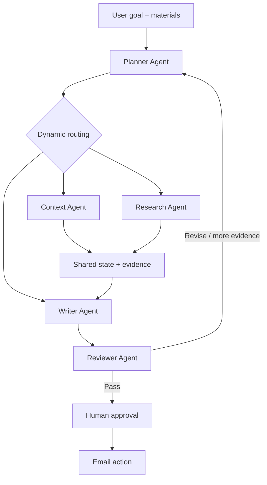

# ContextMail

**An intent-aware AI communication agent that plans, prepares context, drafts and verifies important emails before users take external action.**

[**Live Demo →**](https://nbrhyq.github.io/ContextMail/) · [Explore the architecture](#architecture) · [Run locally](#local-development)

> ContextMail is not another prompt-to-email generator. It decides what a communication task needs, activates the appropriate workflow, grounds the draft in evidence, reviews the result and waits for human approval.

## Product Overview

Important emails are high-context decisions disguised as writing tasks. A job application needs evidence from a resume and role description. PhD outreach may need proposal context and recipient research. A school matter may only need a clear explanation and respectful tone.

ContextMail starts from the user’s outcome rather than a fixed template:

```text
Goal + Materials → Understand → Plan → Prepare Context → Draft → Review → Human Approval
```

## Problem

- Context is fragmented across CVs, job descriptions, proposals and screenshots.
- Users spend time researching recipients and deciding what is relevant.
- Generic AI writers depend on the user organizing everything into one prompt.
- Fluent drafts can contain unsupported claims.
- Important external communication needs an explicit human decision.

## Solution

The Planner identifies the task, checks whether context is sufficient and dynamically selects only the agents and tools that are required. Specialist agents communicate through typed shared state and structured evidence. The Reviewer does not rewrite the draft—it returns a decision to the Planner, which can revise, gather evidence or ask the user for missing information.

## Core Scenarios

| Scenario | Example workflow |
| --- | --- |
| Job application | Planner → Context → Writer → Reviewer |
| PhD outreach | Planner → Context → Research → Writer → Reviewer |
| School affairs | Planner → Writer → Reviewer |

The [interactive demo](https://nbrhyq.github.io/ContextMail/) lets visitors run all three workflows using clearly marked simulated materials and evidence.

## Agent Workflow



## Architecture

- **Planner Agent** — intent recognition, missing-information detection, task decomposition and routing.
- **Context Agent** — PDF, DOCX and TXT extraction into goal-relevant evidence.
- **Research Agent** — external-context contract; safely mocked in the current MVP.
- **Writer Agent** — drafts only from the goal, recipient data and verified evidence.
- **Reviewer Agent** — checks factuality, personalization, tone and completeness.
- **LangGraph workflow** — adaptive routing, review decisions and bounded re-planning.
- **SQLite run store** — local run state and execution trace persistence.
- **Ollama / Qwen3** — local structured-output Planner, Writer and Reviewer with deterministic fallbacks.

## Interactive Demo

The deployed site is a static product demonstration designed for portfolio review. It includes:

- an editable natural-language goal with three example prompts;
- simulated Planner intent recognition after the user runs the agent;
- animated agent activity rather than an instant result;
- scenario-specific dynamic routing;
- expandable Planner Decision;
- evidence provenance and simulated-data labels;
- editable email subject and body;
- Approve and Reject states;
- an explicit explanation that no real email is sent.

The demo never calls the backend, Ollama, a research provider or an email provider.

## Human-in-the-loop

Every external email action sits behind an approval boundary:

```text
AI work → Action preview → Human approval → External action
```

The backend mock email tool raises an error unless approval status is explicitly `APPROVED`. The static demo only visualizes this behavior and cannot send email.

## Evaluation

The evaluation contracts support future comparison between a single-LLM baseline and the agent system across:

- Intent Accuracy
- Task Completion Rate
- Unsupported Claim Rate
- Draft Acceptance Rate
- User Edit Distance
- Time-to-Ready
- LLM Calls per Task
- Estimated Cost per Task

**Evaluation framework implemented. Benchmark testing in progress. No benchmark results are claimed.**

## Tech Stack

| Area | Technology |
| --- | --- |
| Frontend | Next.js, React, TypeScript, static export |
| Agent backend | Python, FastAPI, LangGraph, Pydantic |
| Local LLM | Ollama with `qwen3:latest` |
| Storage | SQLite |
| Testing | Pytest, Next.js lint and production build |
| Delivery | GitHub Actions and GitHub Pages |

## Local Development

### Static product demo

```bash
cd frontend
pnpm install
pnpm dev
```

### Agent backend

```bash
python3 -m venv .venv
source .venv/bin/activate
python -m pip install -e '.[dev,workflow,documents]'
ollama serve
uvicorn app.main:app --app-dir backend --reload
```

### Verification

```bash
.venv/bin/python -m pytest
cd frontend
pnpm lint
pnpm build
```

## Roadmap

### Implemented

- Planner-based orchestration and dynamic routing
- Typed shared state and evidence structure
- Context, Writer and Reviewer workflow
- Bounded re-planning
- Human approval design and mock email action
- Static interactive portfolio demo
- CI and GitHub Pages deployment

### Demo / Mock

- Static demo scenarios, materials, research evidence and email outcomes
- Web research provider
- Email sending

### Planned

- Real research provider
- Microsoft Graph Outlook integration
- Benchmark evaluation dataset and reports
- User testing and personalization

## Current Limitations

- The online demo is deliberately static and does not run the Python agent system.
- External web research is mocked to prevent unsupported real-world claims.
- Email delivery is mocked and cannot contact recipients.
- The local Qwen3 setup depends on the user running Ollama.
- Evaluation schemas exist, but benchmark experiments are not yet complete.

## Repository Structure

```text
backend/              FastAPI and LangGraph agent MVP
frontend/             Static interactive portfolio demo
.github/workflows/    CI and GitHub Pages deployment
```

## Safety

Secrets are loaded from environment variables. `.env`, virtual environments, databases, uploads, dependency folders and generated builds are excluded from version control.
