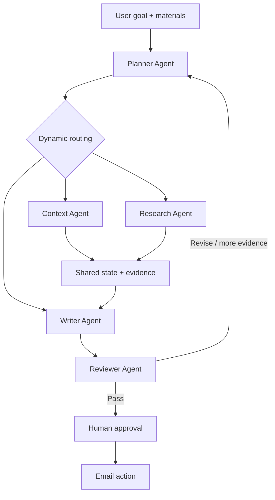

# ContextMail

**An intent-aware AI communication agent that plans, prepares context, drafts and verifies important emails before users take external action.**

[**Live Demo →**](https://nbrhyq.github.io/ContextMail/) · [Explore the architecture](#architecture) · [Run locally](#local-development)

> ContextMail is not another prompt-to-email generator. It decides what a communication task needs, activates the appropriate workflow, grounds the draft in evidence, reviews the result and waits for human approval.

## Product Overview

Important emails are high-context decisions disguised as writing tasks. A job application needs evidence from a resume and role description. PhD outreach may need proposal context and recipient research. A school matter may only need a clear explanation and respectful tone.

ContextMail starts from the user’s outcome rather than a fixed template:

```text
Goal + Materials → Understand → Plan → Prepare Context → Draft → Review → Human Approval
```

## Problem

- Context is fragmented across CVs, job descriptions, proposals and screenshots.
- Users spend time researching recipients and deciding what is relevant.
- Generic AI writers depend on the user organizing everything into one prompt.
- Fluent drafts can contain unsupported claims.
- Important external communication needs an explicit human decision.

## Solution

The Planner identifies the task, checks whether context is sufficient and dynamically selects only the agents and tools that are required. Specialist agents communicate through typed shared state and structured evidence. The Reviewer does not rewrite the draft—it returns a decision to the Planner, which can revise, gather evidence or ask the user for missing information.

## Core Scenarios

| Scenario | Example workflow |
| --- | --- |
| Job application | Planner → Context → Writer → Reviewer |
| PhD outreach | Planner → Context → Research → Writer → Reviewer |
| School affairs | Planner → Writer → Reviewer |

The [interactive demo](https://nbrhyq.github.io/ContextMail/) lets visitors run all three workflows using clearly marked simulated materials and evidence.

## Agent Workflow



## Architecture

- **Planner Agent** — intent recognition, missing-information detection, task decomposition and routing.
- **Context Agent** — PDF, DOCX and TXT extraction into goal-relevant evidence.
- **Research Agent** — plans missing-information queries and retains relevant Brave Search results in LIVE mode.
- **Writer Agent** — drafts only from the goal, recipient data and verified evidence.
- **Reviewer Agent** — checks factuality, personalization, tone and completeness.
- **LangGraph workflow** — adaptive routing, review decisions and bounded re-planning.
- **SQLite run store** — local run state and execution trace persistence.
- **Microsoft Graph** — delegated `Mail.Send` action after explicit approval; Mock remains the default.
- **Ollama / Qwen3 8B** — local structured-output Planner, Writer and Reviewer with deterministic fallbacks.

## Interactive Demo

The deployed site is a static product demonstration designed for portfolio review. It includes:

- an editable natural-language goal with three example prompts;
- simulated Planner intent recognition after the user runs the agent;
- animated agent activity rather than an instant result;
- scenario-specific dynamic routing;
- expandable Planner Decision;
- evidence provenance and simulated-data labels;
- editable email subject and body;
- Approve and Reject states;
- an explicit explanation that no real email is sent.

The demo never calls the backend, Ollama, a research provider or an email provider.

## Human-in-the-loop

Every external email action sits behind an approval boundary:

```text
AI work → Action preview → Human approval → External action
```

Both email providers raise an error unless approval status is explicitly `APPROVED`. Local Outlook mode calls `/me/sendMail` only after the preview boundary. This preserves the least-privileged delegated `Mail.Send` scope; cloud-draft creation would require broader `Mail.ReadWrite`. The static demo only visualizes this behavior and cannot send email.

## Evaluation

The repository includes 80 curated cases: 25 Job Application, 25 PhD Outreach, 20 School Affairs and 10 Ambiguous/Other. A fair single-generation baseline is compared with ContextMail across:

- Intent Accuracy
- Task Completion Rate
- Unsupported Claim Rate
- Draft Acceptance Rate
- User Edit Distance
- Time-to-Ready
- LLM Calls per Task
- Estimated Cost per Task

The repeatable CI-safe workflow suite produced:

| Metric | Single-generation smoke baseline | ContextMail |
| --- | ---: | ---: |
| Task completion | 72.5% | 100.0% |
| Hard-case completion | 53.9% | 100.0% |
| Intent accuracy | n/a | 100.0% |
| Mean local orchestration time | ~0 ms | ~3.5 ms |
| LLM calls | 0 | 0 |

These are V2 deterministic regression checks after optimizing on the same dataset, not model-quality or real-user-acceptance claims; 100% may reflect overfitting. The LIVE runner uses the same local Qwen3 8B for both variants and writes a separate report. Token counts are recorded when Ollama returns them; local-model monetary cost remains unavailable. See the [evaluation report](evaluation/results/report.md), [V0/V1/V2 analysis](evaluation/results/iteration_analysis.md) and [bad-case analysis](evaluation/results/bad_cases.md).

The 12-case stratified LIVE run was less favorable:

| Metric | Single LLM | ContextMail |
| --- | ---: | ---: |
| Task completion | 75.0% | 58.3% |
| Mean time-to-ready | 16.8 s | 91.0 s |
| Mean LLM calls | 1.00 | 2.83 |
| Input / output tokens | 1,028 / 3,142 | 8,351 / 16,291 |

The finding is deliberately nuanced: simple tasks are well served by one drafting step, and the current Qwen3 8B agent loop has not yet proven a completion benefit on the small LIVE sample. Reviewer/re-plan exhaustion caused several failures. Based on this result, re-planning is now capped at one targeted retry. Adaptive routing remains the product direction for ambiguity and factual risk, but authenticated evidence and human evaluation are still required before claiming an agent advantage. See the [LIVE report](evaluation/results/live_report.md) and [LIVE bad cases](evaluation/results/live_bad_cases.md).

## Product Case Study

**Initial MVP.** A planner routed requests through Context, Research, Writer and Reviewer, but research and delivery remained mocked and the evaluation layer was only a schema.

**Product hypothesis.** Important communication is not merely text generation: the system should spend additional latency only when context fragmentation, current external facts or factual risk justify it.

**Validation.** V0 exposed weak intent boundaries and shallow missing-material checks. Bad cases drove weighted scenario signals, a strict ambiguity gate and document-type-aware context checks. The deterministic contract suite moved from 52.5% completion in V0 to 90.0% in V1 and 100% in V2. Because V2 was tuned on the same cases, the result is treated as regression coverage rather than generalization proof.

**Final product decision.** LOW tasks use Writer only. MEDIUM/HIGH tasks may add Context, Research and Reviewer, but the LIVE result makes reviewer-loop reduction a release criterion rather than assuming more agents are better. Every external send still stops at human approval.

**Next validation.** Recruit 5–10 target users for blinded draft ratings, capture their edits, and compare task-level acceptance, edit distance and time-to-ready against the single-LLM baseline.

## Tech Stack

| Area | Technology |
| --- | --- |
| Frontend | Next.js, React, TypeScript, static export |
| Agent backend | Python, FastAPI, LangGraph, Pydantic |
| Local LLM | Ollama with `qwen3:latest` |
| Storage | SQLite |
| Testing | Pytest, Next.js lint and production build |
| Delivery | GitHub Actions and GitHub Pages |

## Local Development

### Static product demo

```bash
cd frontend
pnpm install
pnpm dev
```

### Agent backend

```bash
python3 -m venv .venv
source .venv/bin/activate
python -m pip install -e '.[dev,workflow,documents,outlook]'
ollama serve
uvicorn app.main:app --app-dir backend --reload
```

The reference setup uses `qwen3:latest`, which reports 8.2B parameters in Ollama.

### Real research (local LIVE mode)

The [Brave Search API](https://api-dashboard.search.brave.com/app/documentation/web-search/get-started) adapter only retrieves results; the Research Agent decides what is missing, constructs queries and retains evidence.

```bash
CONTEXTMAIL_SEARCH_PROVIDER=brave
CONTEXTMAIL_BRAVE_SEARCH_API_KEY=your_key
```

Without a key, keep `CONTEXTMAIL_SEARCH_PROVIDER=mock`. The app and CI remain operational and never fabricate web evidence.

### Microsoft Outlook / Entra setup

1. Register a public client application in Microsoft Entra.
2. Enable public client/device-code flows and add delegated Microsoft Graph permission `Mail.Send`.
3. Add the identifiers to `.env`:

```bash
CONTEXTMAIL_EMAIL_PROVIDER=outlook
CONTEXTMAIL_MICROSOFT_CLIENT_ID=your_application_client_id
CONTEXTMAIL_MICROSOFT_TENANT_ID=your_directory_tenant_id
```

4. Authenticate once:

```bash
PYTHONPATH=backend .venv/bin/python -m app.tools.outlook_auth
```

The delegated session is stored in gitignored `.contextmail/msal_token_cache.json` with owner-only permissions. No client secret is required for this public-client flow, and tokens are never logged. To, Subject, text Body and uploaded Attachments are supported. See Microsoft Graph's least-privileged [`Mail.Send` documentation](https://learn.microsoft.com/en-us/graph/api/user-sendmail?view=graph-rest-1.0).

### Run evaluation

```bash
# Repeatable 80-case deterministic workflow suite
PYTHONPATH=backend .venv/bin/python -m app.evaluation.run_benchmark

# Same-model Qwen3 8B LIVE comparison (slower)
PYTHONPATH=backend .venv/bin/python -m app.evaluation.run_benchmark --live
```

### Verification

```bash
.venv/bin/python -m pytest
cd frontend
pnpm lint
pnpm build
```

## Roadmap

### Implemented

- Planner-based orchestration and dynamic routing
- Typed shared state and evidence structure
- Context, Writer and Reviewer workflow
- Bounded re-planning
- Brave Search LIVE provider with traceable evidence
- Delegated Microsoft Graph email action after approval
- 80-case benchmark and automated bad-case reporting
- Evaluation-led LOW / MEDIUM / HIGH routing
- Static interactive portfolio demo
- CI and GitHub Pages deployment

### Demo / Mock

- Static demo scenarios, materials, research evidence and email outcomes
- Hosted-demo web research and email sending

### Planned

- Blinded human draft evaluation and real edit-distance capture
- Authenticated end-to-end user testing
- Consent-based personalization

## Current Limitations

- The online demo is deliberately static and does not run the Python agent system.
- LIVE research requires a user-supplied Brave key; CI and the hosted demo use Mock.
- LIVE email requires a user-owned Entra app and delegated login; CI and the hosted demo use Mock.
- The local Qwen3 setup depends on the user running Ollama.
- The dataset is curated/synthetic and automated quality is not real-user acceptance.
- No human-edited reference corpus exists yet, so edit distance is unavailable.
- Local-model monetary cost is marked unavailable rather than fabricated.

## Repository Structure

```text
backend/              FastAPI and LangGraph agent MVP
frontend/             Static interactive portfolio demo
evaluation/results/   Reports and bad-case analysis
.github/workflows/    CI and GitHub Pages deployment
```

## Safety

Secrets are loaded from environment variables. `.env`, virtual environments, databases, uploads, dependency folders and generated builds are excluded from version control.
